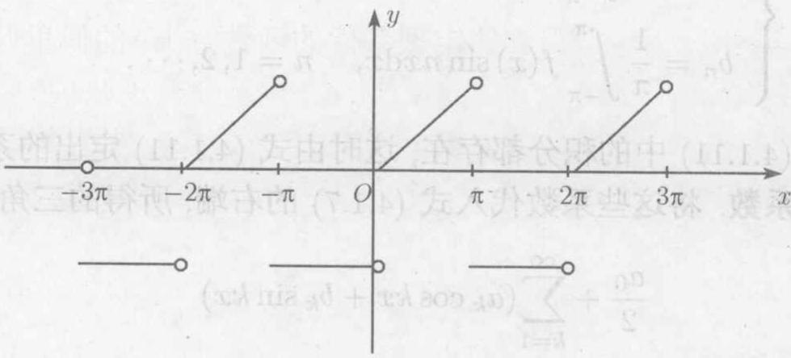
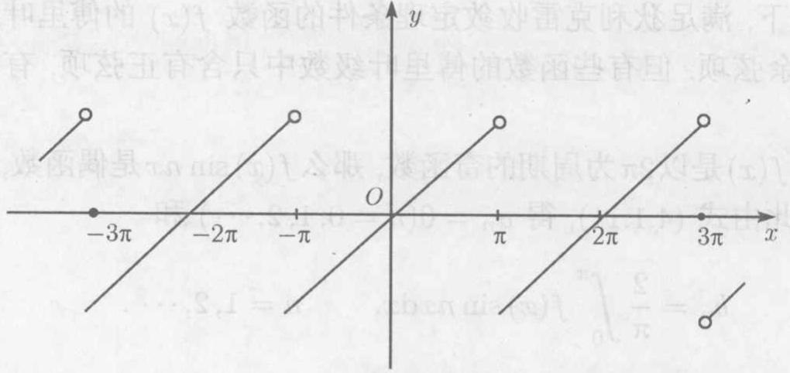
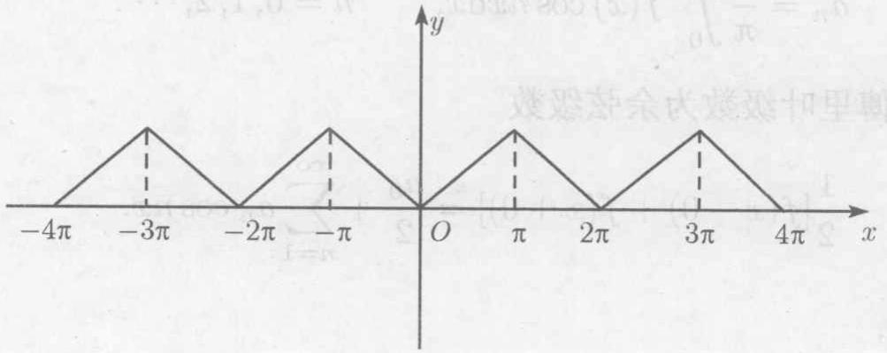
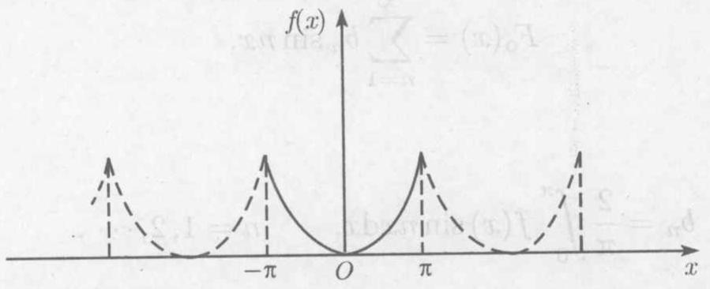
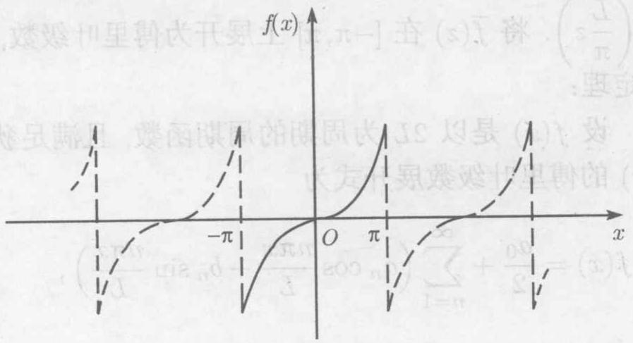

# 第04章 分离变量法

> 本文件是阅读主文件：基于 Pix2Text OCR → Tesseract 文字校正 → 人工精校三步处理，已校正中文段落、标题、定义、定理、性质、例题、习题题干中的 OCR 错字，明显可还原的数学公式已重写为 LaTeX；不确定的公式保留原 OCR 并加 `[待核对]`。
> 图片引用已根据PDF内容校准插入位置。

---

<!-- 原PDF页 79 / 本章第 1 页 -->

本章介绍的分离变量法又称傅里叶级数法，它是解数学物理方程定解问题的最常用和最基本的方法之一。它能够求解相当多的定解问题，特别是对一些常见区域（如有限区间、矩形域、圆域、长方体、球面、圆柱体等）上混合问题和边值问题，都可以用分离变量法试着求解。该方法的特点是通过变量的分离，把偏微分方程化成常微分方程来求解。它的主要依据是第1章中的线性叠加原理和本章4.5节介绍的施图姆-刘维尔（Sturm-Liouville）的特征值理论。

## 4.1 正交函数系和傅里叶级数

在这一节里，我们介绍正交函数系和函数傅里叶级数的一些基本概念与结果，它们是分离变量法求解数学物理方程定解问题的基础。

### 4.1.1 正交函数系

设权函数 $\rho = \rho(x) > 0$ 在区间 $[a, b]$ 上可积，如果在 $[a, b]$ 上定义的可积函数 $\phi(x), \psi(x)$ 满足

$$
\int_{a}^{b} \phi(x) \psi(x) \rho(x) \, dx = 0, \tag{4.1.1}
$$

则称 $\phi(x), \psi(x)$ 在区间 $[a, b]$ 上关于权函数 $\rho(x)$ 是正交的。

设 $[a, b]$ 上可积函数系 $\{\phi_n(x)\}_{n=1}^{\infty}$ 满足

$$
\int_{a}^{b} \phi_n(x) \phi_m(x) \rho(x) \, dx = 0, \qquad m \neq n, \; m, n = 1, 2, \cdots, \tag{4.1.2}
$$

$$
\int_{a}^{b} \phi_n^2(x) \rho(x) \, dx > 0, \qquad n = 1, 2, \cdots. \tag{4.1.3}
$$

我们称 $\phi_n(x)$ 的模为 $\|\phi_n\|_2$，即

$$
\|\phi_n\|_2 = \sqrt{\int_{a}^{b} \phi_n^2(x) \rho(x) \, dx}, \qquad n = 1, 2, \cdots. \tag{4.1.4}
$$

特别地，当 $\rho(x) \equiv 1$ 时，简称 $\{\phi_n(x)\}_{n=1}^{\infty}$ 是 $[a, b]$ 上的正交函数系。进一步地，如果还有

$$
\int_{a}^{b} \bar{\phi}_n(x) \bar{\phi}_m(x) \, dx =
\begin{cases}
0, & n \neq m, \\
1, & n = m,
\end{cases}
$$

则称 $\{\phi_n(x)\}_{n=1}^{\infty}$ 为区间 $[a, b]$ 上的标准正交函数系（或规范正交函数系）。显然，一个标准正交函数系可由正交函数系的每个函数除以它的模而得到。

**例 4.1.1** 三角函数系

$$
1, \cos x, \sin x, \cos 2x, \sin 2x, \cdots, \cos nx, \sin nx, \cdots
$$

是区间 $[-\pi, \pi]$ 上的正交函数系。

事实上，利用三角恒等式

$$
\begin{aligned}
\sin \alpha \cdot \cos \beta &= \frac{1}{2} \left( \sin(\alpha-\beta) + \sin(\alpha+\beta) \right), \\
\sin \alpha \cdot \sin \beta &= \frac{1}{2} \left( \cos(\alpha-\beta) - \cos(\alpha+\beta) \right), \\
\cos \alpha \cdot \cos \beta &= \frac{1}{2} \left( \cos(\alpha-\beta) + \cos(\alpha+\beta) \right),
\end{aligned}
$$

可知，对任意的 $n$ 和 $m$，有

$$
\int_{-\pi}^{\pi} \sin nx \sin mx \, dx =
\begin{cases}
0, & n \neq m, \\
\pi, & n = m;
\end{cases} \tag{4.1.5}
$$

$$
\int_{-\pi}^{\pi} \cos nx \cos mx \, dx =
\begin{cases}
0, & n \neq m, \\
\pi, & n = m;
\end{cases} \tag{4.1.6}
$$

$$
\int_{-\pi}^{\pi} \sin nx \cos mx \, dx = 0; \tag{4.1.7}
$$

并且

$$
\int_{-\pi}^{\pi} \sin nx \, dx = \int_{-\pi}^{\pi} \cos nx \, dx = 0.
$$

于是

$$
\frac{1}{\sqrt{2\pi}}, \frac{\cos x}{\sqrt{\pi}}, \frac{\sin x}{\sqrt{\pi}}, \frac{\cos 2x}{\sqrt{\pi}}, \frac{\sin 2x}{\sqrt{\pi}}, \cdots, \frac{\cos nx}{\sqrt{\pi}}, \frac{\sin nx}{\sqrt{\pi}}, \cdots
$$

是区间 $[-\pi, \pi]$ 上的标准正交函数系。

显然，子函数系 $\sin nx \ (n = 1, 2, \cdots)$ 和 $\cos mx \ (m = 0, 1, 2, \cdots)$ 是区间 $[-\pi, \pi]$ 上的正交函数系，而 $\frac{\sin nx}{\sqrt{\pi}} \ (n = 1, 2, \cdots)$ 和 $\frac{1}{\sqrt{2\pi}}, \frac{\cos mx}{\sqrt{\pi}} \ (m = 1, 2, \cdots)$ 是区间 $[-\pi, \pi]$ 上的标准正交函数系。

**例 4.1.2** 三角函数系

$$
1, \cos \frac{\pi x}{L}, \sin \frac{\pi x}{L}, \cos \frac{2\pi x}{L}, \sin \frac{2\pi x}{L}, \cdots, \cos \frac{n\pi x}{L}, \sin \frac{n\pi x}{L}, \cdots
$$

是区间 $[-L, L]$ 上的正交函数系。

---

<!-- 原PDF页 80 / 本章第 2 页 -->

### 4.1.2 傅里叶级数

#### 1. $[-\pi, \pi]$ 上函数 $f(x)$ 的傅里叶级数

设 $f(x)$ 是以 $2\pi$ 为周期的函数，且在 $[-\pi, \pi]$ 上可展开成三角级数

$$
f(x) = \frac{a_0}{2} + \sum_{k=1}^{\infty} (a_k \cos kx + b_k \sin kx). \tag{4.1.8}
$$

又设 $n$ 是任一正整数，用 $\cos nx$ 乘以式（4.1.8）的两边，并在 $[-\pi, \pi]$ 上积分，得

$$
\int_{-\pi}^{\pi} f(x) \cos nx \, dx = \int_{-\pi}^{\pi} \frac{a_0}{2} \cos nx \, dx + \sum_{k=1}^{\infty} \int_{-\pi}^{\pi} (a_k \cos kx + b_k \sin kx) \cos nx \, dx.
$$

由于三角函数系（例4.1.1）的正交性，等式右端除 $k=n$ 这项外，其余各项均为0，所以

$$
\int_{-\pi}^{\pi} f(x) \, dx = \int_{-\pi}^{\pi} \frac{a_0}{2} \, dx + \sum_{k=1}^{\infty} \int_{-\pi}^{\pi} (a_k \cos kx + b_k \sin kx) \, dx = a_0 \pi.
$$

于是

$$
a_0 = \frac{1}{\pi} \int_{-\pi}^{\pi} f(x) \, dx. \tag{4.1.9}
$$

同理

$$
\int_{-\pi}^{\pi} f(x) \cos nx \, dx = a_n \int_{-\pi}^{\pi} \cos^2 nx \, dx = a_n \pi,
$$

$$
a_n = \frac{1}{\pi} \int_{-\pi}^{\pi} f(x) \cos nx \, dx, \qquad n = 1, 2, \cdots. \tag{4.1.10}
$$

用 $\sin nx$ 乘以式（4.1.8），并在 $[-\pi, \pi]$ 上积分，可得

$$
b_n = \frac{1}{\pi} \int_{-\pi}^{\pi} f(x) \sin nx \, dx, \qquad n = 1, 2, \cdots. \tag{4.1.11}
$$

注意到当 $n=0$ 时，$a_n$ 的表达式（4.1.10）正好给出 $a_0$，从而可把式（4.1.9）和式（4.1.10）合并为

$$
\begin{cases}
a_n = \frac{1}{\pi} \int_{-\pi}^{\pi} f(x) \cos nx \, dx, \quad n = 0, 1, 2, \cdots, \\
b_n = \frac{1}{\pi} \int_{-\pi}^{\pi} f(x) \sin nx \, dx, \quad n = 1, 2, \cdots.
\end{cases} \tag{4.1.12}
$$

如果公式（4.1.12）中的积分都存在，这时由式（4.1.12）定出的系数 $a_n, b_n$ 称为 $f(x)$ 的傅里叶系数。将这些系数代入式（4.1.8）的右端，所得的三角级数

$$
\frac{a_0}{2} + \sum_{k=1}^{\infty} (a_k \cos kx + b_k \sin kx) \tag{4.1.13}
$$

称为 $f(x)$ 的傅里叶级数，记为

$$
f(x) \sim \frac{a_0}{2} + \sum_{k=1}^{\infty} (a_k \cos kx + b_k \sin kx). \tag{4.1.14}
$$

对于周期为 $2\pi$ 的可积函数 $f(x)$，尽管可以由式（4.1.12）确定傅里叶系数 $a_n, b_n$，从而作出其傅里叶级数式（4.1.13），但我们还不能断定这个级数是否收敛？并且即使收敛，它的和函数是否就是 $f(x)$？一般来说这两个问题的答案都不是肯定的。那么 $f(x)$ 在什么样的条件下，它的傅里叶级数一定收敛，并且收敛于 $f(x)$？下面我们给出一个收敛定理，它的证明不予叙述，有兴趣的读者可参见《数学分析》教材的有关内容。

**定理 4.1.1（狄利克雷（Dirichlet）收敛定理）** 设以 $2\pi$ 为周期的函数 $f(x)$ 满足狄利克雷条件：

1. $f(x), f'(x)$ 在 $[-\pi, \pi]$ 上连续或分段连续，且至多只有有限个第一类间断点；
2. $f(x)$ 在 $[-\pi, \pi]$ 上至多有有限个极值点。

则 $f(x)$ 的傅里叶级数收敛，且

- 当 $x$ 是 $f(x)$ 的连续点时，级数收敛于 $f(x)$；
- 当 $x$ 是 $f(x)$ 的第一类间断点时，级数收敛于函数在该点处的左右极限的算术平均值 $\frac{1}{2}[f(x+0) + f(x-0)]$，即

$$
\frac{1}{2}[f(x+0) + f(x-0)] = \frac{a_0}{2} + \sum_{k=1}^{\infty} (a_k \cos kx + b_k \sin kx), \tag{4.1.15}
$$

其中 $a_n, b_n$ 由式（4.1.12）确定。

狄利克雷收敛定理表明，满足狄利克雷条件的以 $2\pi$ 为周期的函数 $f(x)$，如果 $x$ 是它的连续点，则它的傅里叶级数收敛于 $f(x)$。如果 $x$ 是它的第一类间断点，则其傅里叶级数收敛于函数在该点处的左右极限的算术平均值 $[f(x+0) + f(x-0)]/2$。

---

<!-- 原PDF页 81 / 本章第 3 页 -->

**例 4.1.3** 设 $f(x)$ 是以 $2\pi$ 为周期的函数，它在 $[-\pi, \pi]$ 上的表达式为

$$
f(x) =
\begin{cases}
-\pi, & -\pi \leqslant x < 0, \\
x, & 0 \leqslant x < \pi.
\end{cases}
$$

函数 $f(x)$ 的图形见图 4.3。

图 4.3

将 $f(x)$ 展开成傅里叶级数。

**解** 显然 $f(x)$ 满足狄利克雷条件。由式（4.1.12）得

$$
\begin{aligned}
a_0 &= \frac{1}{\pi} \int_{-\pi}^{\pi} f(x) \, dx = \frac{1}{\pi} \left( -\int_{-\pi}^{0} \pi \, dx + \int_{0}^{\pi} x \, dx \right) = -\frac{\pi}{2}, \\
a_n &= \frac{1}{\pi} \int_{-\pi}^{\pi} f(x) \cos nx \, dx \\
&= \frac{1}{\pi} \left( -\int_{-\pi}^{0} \pi \cos nx \, dx + \int_{0}^{\pi} x \cos nx \, dx \right) \\
&= \frac{1}{\pi n^2} [(-1)^n - 1], \\
b_n &= \frac{1}{\pi} \int_{-\pi}^{\pi} f(x) \sin nx \, dx \\
&= \frac{1}{\pi} \left( -\int_{-\pi}^{0} \pi \sin nx \, dx + \int_{0}^{\pi} x \sin nx \, dx \right) \\
&= \frac{1}{n} [1 - 2(-1)^n].
\end{aligned}
$$

于是 $f(x)$ 的傅里叶级数为

$$
f(x) = -\frac{\pi}{4} + \sum_{n=1}^{\infty} \left[ \frac{1}{\pi n^2} ((-1)^n - 1) \cos nx + \frac{1}{n} (1 - 2(-1)^n) \sin nx \right],
$$

这里 $x \in (-\infty, +\infty), x \neq k\pi, k = 0, \pm 1, \pm 2, \cdots$。在 $x = 2k\pi$ 处，级数收敛于 $-\frac{\pi}{2}$；在 $x = (2k+1)\pi$ 处，级数收敛于 $\frac{-\pi + \pi}{2} = 0, \, k = 0, \pm 1, \pm 2, \cdots$。

应当注意，如果 $f(x)$ 只在 $[-\pi, \pi)$ 上有定义，且满足狄利克雷收敛定理的条件，那么可在 $[-\pi, \pi)$ 外补充函数 $f(x)$ 的定义，使它拓广成周期为 $2\pi$ 的函数 $F(x)$，称为周期延拓。再将 $F(x)$ 展开成傅里叶级数，然后限制 $x$ 在 $[-\pi, \pi)$ 上，$F(x) = f(x)$。这样便得到了 $f(x)$ 的傅里叶级数展开式。根据狄利克雷收敛定理，当 $x = \pm \pi$ 时，级数收敛于 $\frac{1}{2}[f(\pi-0) + f(-\pi+0)]$。

#### 2. 正弦级数和余弦级数

一般情况下，满足狄利克雷收敛定理条件的函数 $f(x)$ 的傅里叶级数中既有正弦项，又含有余弦项。但有些函数的傅里叶级数中只含有正弦项，有的只含有常数项和余弦项。

如果函数 $f(x)$ 是以 $2\pi$ 为周期的奇函数，那么 $f(x) \sin nx$ 是偶函数，而 $f(x) \cos nx$ 是奇函数。因此由式（4.1.12）得 $a_n = 0 \ (n = 0, 1, 2, \cdots)$ 和

$$
b_n = \frac{2}{\pi} \int_{0}^{\pi} f(x) \sin nx \, dx, \qquad n = 1, 2, \cdots. \tag{4.1.16}
$$

可见 $f(x)$ 的傅里叶级数中只含有正弦项，即

$$
\frac{1}{2}[f(x-0) + f(x+0)] = \sum_{n=1}^{\infty} b_n \sin nx. \tag{4.1.17}
$$

所以当 $x$ 是 $f(x)$ 的连续点时，则

$$
f(x) = \sum_{n=1}^{\infty} b_n \sin nx, \tag{4.1.18}
$$

其中 $b_n$ 由式（4.1.16）确定。

类似地，如果函数 $f(x)$ 是以 $2\pi$ 为周期的偶函数，那么由式（4.1.12）得 $b_n = 0 \ (n = 1, 2, \cdots)$ 和

$$
a_n = \frac{2}{\pi} \int_{0}^{\pi} f(x) \cos nx \, dx, \qquad n = 0, 1, 2, \cdots. \tag{4.1.19}
$$

于是当 $x$ 是 $f(x)$ 的连续点时，

$$
f(x) = \frac{a_0}{2} + \sum_{n=1}^{\infty} a_n \cos nx, \tag{4.1.20}
$$

其中 $a_n$ 由式（4.1.19）确定。

**例 4.1.4** 设 $f(x)$ 是以 $2\pi$ 为周期的函数，它在 $[-\pi, \pi)$ 上表达式为 $f(x) = x$。将 $f(x)$ 展开成傅里叶级数。

**解** 如图4.2所示，容易知道 $f(x)$ 是奇函数，且满足狄利克雷收敛定理的条件。因此 $a_n = 0 \ (n = 0, 1, 2, \cdots)$ 和

$$
b_n = \frac{2}{\pi} \int_{0}^{\pi} f(x) \sin nx \, dx = \frac{2}{\pi} \int_{0}^{\pi} x \sin nx \, dx = (-1)^{n+1} \frac{2}{n}, \quad n = 1, 2, \cdots.
$$

图 4.2

于是 $f(x)$ 的傅里叶级数为

$$
f(x) = 2 \left( \sin x - \frac{1}{2} \sin 2x + \frac{1}{3} \sin 3x - \cdots + \frac{(-1)^{n+1}}{n} \sin nx + \cdots \right),
$$

这里 $x \in (-\infty, +\infty), \; x \neq (2k+1)\pi, k = 0, \pm 1, \pm 2, \cdots$。

---

<!-- 原PDF页 82 / 本章第 4 页 -->

**例 4.1.5** 设 $f(x)$ 是以 $2\pi$ 为周期的函数，在 $[-\pi, \pi)$ 上的表达式为 $f(x) = |x|$。将 $f(x)$ 展开为傅里叶级数。

**解** 函数 $f(x)$ 如图4.4所示。容易验证 $f(x)$ 在 $[-\pi, \pi)$ 上为偶函数，且满足狄利克雷收敛条件。因此 $b_n = 0 \ (n = 1, 2, \cdots)$ 和

$$
a_0 = \frac{2}{\pi} \int_{0}^{\pi} f(x) \, dx = \frac{2}{\pi} \int_{0}^{\pi} x \, dx = \pi,
$$

图 4.4

$$
a_n = \frac{2}{\pi} \int_{0}^{\pi} f(x) \cos nx \, dx = \frac{-2}{\pi n^2} (1 - \cos n\pi) = \frac{-2}{\pi n^2} (1 - (-1)^n).
$$

故

$$
\begin{aligned}
f(x) = |x| &= \frac{\pi}{2} - \frac{4}{\pi} \sum_{n=1}^{\infty} \frac{1}{(2n-1)^2} \cos (2n-1)x \\
&= \frac{\pi}{2} - \frac{4}{\pi} \left( \cos x + \frac{1}{3^2} \cos 3x + \frac{1}{5^2} \cos 5x + \cdots \right), \quad x \in (-\infty, +\infty).
\end{aligned}
$$

如果 $f(x)$ 只定义在区间 $[0, \pi)$ 中（见图4.4），我们可以拓广 $f(x)$ 使其定义在 $(-\infty, +\infty)$ 且以 $2\pi$ 为周期。第一种方法是作出 $f(x)$ 的偶延拓（图4.5），定义

$$
F_e(x) =
\begin{cases}
f(x), & 0 \leqslant x < \pi, \\
f(-x), & -\pi \leqslant x < 0.
\end{cases}
$$

第二种方法是作出 $f(x)$ 的奇延拓（图4.5），定义

$$
F_o(x) =
\begin{cases}
f(x), & 0 \leqslant x < \pi, \\
-f(-x), & -\pi \leqslant x < 0.
\end{cases}
$$

因为 $F_e(x)$ 和 $F_o(x)$ 分别是以 $2\pi$ 为周期的偶函数和奇函数，所以 $F_e(x)$ 和 $F_o(x)$ 的傅里叶展开式分别是余弦级数及正弦级数。因此，定义在 $[0, \pi)$ 上的函数 $f(x)$ 既可以展开成傅里叶余弦级数又可以展开成傅里叶正弦级数。

图 4.5

图 4.6

#### 3. 周期为 $2L$ 函数的傅里叶级数

前面讨论的周期函数是以 $T = 2\pi$ 为周期的，但在许多实际问题中所遇到的周期不一定是 $2\pi$。下面我们讨论 $T = 2L$ 为周期的周期函数的傅里叶级数。

设 $f(x)$ 是以 $2L$ 为周期的函数。通过变量代换 $z = \frac{\pi x}{L}$ 可将 $[-L, L]$ 上的函数 $f(x)$ 转化为 $[-\pi, \pi]$ 中的函数 $\bar{f}(z) = f\left( \frac{L}{\pi} z \right)$。

**定理 4.1.2** 设 $f(x)$ 是以 $2L$ 为周期的周期函数，且满足狄利克雷收敛定理的条件，那么 $f(x)$ 的傅里叶级数展开式为

$$
f(x) = \frac{a_0}{2} + \sum_{n=1}^{\infty} \left( a_n \cos \frac{n\pi x}{L} + b_n \sin \frac{n\pi x}{L} \right), \tag{4.1.21}
$$

其中

$$
\begin{cases}
a_n = \displaystyle \frac{1}{L} \int_{-L}^{L} f(x) \cos \frac{n\pi x}{L} \, dx, \quad n = 0, 1, 2, \cdots, \\
b_n = \displaystyle \frac{1}{L} \int_{-L}^{L} f(x) \sin \frac{n\pi x}{L} \, dx, \quad n = 1, 2, \cdots.
\end{cases} \tag{4.1.22}
$$

当 $x$ 为第一类间断点时，式（4.1.21）的左边应以 $\frac{1}{2}[f(x-0) + f(x+0)]$ 代替（以下同）。

#### 4. 定义在 $[0, L]$ 上的函数的傅里叶展开

对于定义在 $[0, L]$ 上的函数 $f(x)$，如果满足狄利克雷收敛定理的条件，我们可以通过奇延拓和以 $2L$ 为周期的周期延拓，把它展开成傅里叶正弦级数

$$
f(x) = \sum_{n=1}^{\infty} b_n \sin \frac{n\pi x}{L}, \tag{4.1.23}
$$

其中

$$
b_n = \frac{2}{L} \int_{0}^{L} f(x) \sin \frac{n\pi x}{L} \, dx, \quad n = 1, 2, \cdots. \tag{4.1.24}
$$

类似地，通过偶延拓和以 $2L$ 为周期的周期延拓，$f(x)$ 可以展开成傅里叶余弦级数

$$
f(x) = \frac{a_0}{2} + \sum_{n=1}^{\infty} a_n \cos \frac{n\pi x}{L}, \tag{4.1.25}
$$

其中

$$
a_n = \frac{2}{L} \int_{0}^{L} f(x) \cos \frac{n\pi x}{L} \, dx, \qquad n = 0, 1, 2, \cdots. \tag{4.1.26}
$$

**例 4.1.6** 试将定义在区间 $[0, L]$ 上的函数 $f(x) = x - L/2$ 展开成傅里叶正弦级数和余弦级数。

**解** 先将 $f(x)$ 在 $[0, L]$ 上展开成正弦级数。由式（4.1.24）得

$$
b_n = \frac{2}{L} \int_{0}^{L} f(x) \sin \frac{n\pi x}{L} \, dx = \frac{2}{L} \int_{0}^{L} \left( x - \frac{L}{2} \right) \sin \frac{n\pi x}{L} \, dx = \frac{L}{n\pi} ((-1)^{n+1} - 1).
$$

因此当 $n$ 为奇数时，$b_n = 0$；当 $n$ 为偶数时，$b_n = -\frac{2L}{n\pi}$。于是

$$
f(x) = -\frac{L}{\pi} \sum_{k=1}^{\infty} \frac{1}{k} \sin \frac{2k\pi x}{L}, \qquad 0 < x < L.
$$

再将 $f(x)$ 在 $[0, L]$ 上展开成余弦级数。由式（4.1.26）得

$$
a_0 = \frac{2}{L} \int_{0}^{L} f(x) \, dx = \frac{2}{L} \int_{0}^{L} \left( x - \frac{L}{2} \right) dx = 0,
$$

$$
a_n = \frac{2}{L} \int_{0}^{L} f(x) \cos \frac{n\pi x}{L} \, dx = \frac{2}{L} \int_{0}^{L} \left( x - \frac{L}{2} \right) \cos \frac{n\pi x}{L} \, dx = \frac{2L}{n^2 \pi^2} ((-1)^n - 1).
$$

因此当 $n$ 为偶数时，$a_n = 0$；当 $n$ 为奇数时，$a_n = -\frac{4L}{n^2 \pi^2}$。于是

$$
f(x) = -\frac{4L}{\pi^2} \sum_{k=1}^{\infty} \frac{1}{(2k-1)^2} \cos \frac{(2k-1)\pi x}{L}, \qquad 0 < x < L.
$$

#### 5. 定义在任意区间 $[a, b]$ 上函数的傅里叶级数

对于定义在任意区间 $[a, b]$ 上的函数 $f(x)$，我们可以通过变量代换将其转化为区间 $[-L, L]$ 或 $[0, 2L]$ 上的函数，其中 $L = \frac{b-a}{2}$。令

$$
t = x - \frac{a+b}{2},
$$

则当 $x \in [a, b]$ 时，$t \in [-L, L]$。于是 $f(x) = f\left(t + \frac{a+b}{2}\right)$ 可以在 $[-L, L]$ 上展开成傅里叶级数。

或者令 $t = x - a$，则当 $x \in [a, b]$ 时，$t \in [0, b-a] = [0, 2L]$，于是 $f(x) = f(t+a)$ 可以在 $[0, 2L]$ 上展开。

**定理 4.1.3** 设 $f(x)$ 在 $[a, b]$ 上满足狄利克雷条件，则 $f(x)$ 在 $(a, b)$ 内可以展开成傅里叶级数

$$
\frac{1}{2}[f(x-0) + f(x+0)] = \frac{a_0}{2} + \sum_{n=1}^{\infty} \left( a_n \cos \frac{2n\pi(x-a)}{b-a} + b_n \sin \frac{2n\pi(x-a)}{b-a} \right),
$$

其中

$$
\begin{cases}
a_n = \displaystyle \frac{2}{b-a} \int_{a}^{b} f(x) \cos \frac{2n\pi(x-a)}{b-a} \, dx, \quad n = 0, 1, 2, \cdots, \\
b_n = \displaystyle \frac{2}{b-a} \int_{a}^{b} f(x) \sin \frac{2n\pi(x-a)}{b-a} \, dx, \quad n = 1, 2, \cdots.
\end{cases}
$$

---

<!-- 原PDF页 83 / 本章第 5 页 -->

## 4.2 有界弦的自由振动

现在我们用分离变量法来求解两端固定的弦的自由振动问题。这个问题可归结为求解下列定解问题：

$$
\begin{cases}
\displaystyle \frac{\partial^2 u}{\partial t^2} = a^2 \frac{\partial^2 u}{\partial x^2}, \quad 0 < x < L, \, t > 0, \tag{4.2.1} \\[6pt]
u(0, t) = 0, \quad u(L, t) = 0, \quad t \geqslant 0, \tag{4.2.2} \\[6pt]
u(x, 0) = \varphi(x), \quad \displaystyle \frac{\partial u}{\partial t}(x, 0) = \psi(x), \quad 0 \leqslant x \leqslant L. \tag{4.2.3}
\end{cases}
$$

### 4.2.1 分离变量法求解步骤

分离变量法的基本思想是：假设偏微分方程的解可以表示为两个只含单个变量的函数的乘积，即

$$
u(x, t) = X(x) T(t).
$$

将这个表达式代入偏微分方程，就可以把偏微分方程转化为常微分方程。

#### 第一步：分离变量

将 $u(x, t) = X(x) T(t)$ 代入方程（4.2.1），得

$$
X(x) T''(t) = a^2 X''(x) T(t).
$$

将上式两边除以 $a^2 X(x) T(t)$，得

$$
\frac{T''(t)}{a^2 T(t)} = \frac{X''(x)}{X(x)}.
$$

这个等式的左端只与 $t$ 有关，右端只与 $x$ 有关。要使它们对所有的 $0 < x < L, \, t > 0$ 都相等，除非它们都等于同一个常数。记这个常数为 $-\lambda$，则

$$
\frac{T''(t)}{a^2 T(t)} = \frac{X''(x)}{X(x)} = -\lambda.
$$

于是我们得到两个常微分方程：

$$
T''(t) + a^2 \lambda T(t) = 0, \tag{4.2.4}
$$

$$
X''(x) + \lambda X(x) = 0. \tag{4.2.5}
$$

#### 第二步：求解特征值问题

由边界条件（4.2.2），得

$$
u(0, t) = X(0) T(t) = 0, \quad u(L, t) = X(L) T(t) = 0.
$$

因为 $T(t) \not\equiv 0$（否则 $u \equiv 0$ 是平凡解），所以

$$
X(0) = 0, \quad X(L) = 0. \tag{4.2.6}
$$

这样我们就得到了常微分方程（4.2.5）满足边界条件（4.2.6）的非零解问题。这个问题称为**特征值问题**（或本征值问题）。使问题有非零解的 $\lambda$ 值称为**特征值**（或本征值），相应的非零解称为**特征函数**（或本征函数）。

现在我们来求解这个特征值问题。分三种情况讨论：

---

<!-- 原PDF页 84 / 本章第 6 页 -->

**情形 1：$\lambda < 0$**

令 $\lambda = -\mu^2 \ (\mu > 0)$，则方程（4.2.5）变为

$$
X''(x) - \mu^2 X(x) = 0.
$$

其通解为

$$
X(x) = A e^{\mu x} + B e^{-\mu x}.
$$

由边界条件 $X(0) = 0$，得 $A + B = 0$，即 $B = -A$。于是

$$
X(x) = A (e^{\mu x} - e^{-\mu x}) = 2A \sinh \mu x.
$$

再由边界条件 $X(L) = 0$，得 $2A \sinh \mu L = 0$。因为 $\mu L > 0$，所以 $\sinh \mu L > 0$，因此 $A = 0$。从而 $X(x) \equiv 0$，这是平凡解。故当 $\lambda < 0$ 时，没有非零解。

**情形 2：$\lambda = 0$**

此时方程（4.2.5）变为

$$
X''(x) = 0.
$$

其通解为

$$
X(x) = A x + B.
$$

由边界条件 $X(0) = 0$，得 $B = 0$。再由 $X(L) = 0$，得 $A L = 0$，即 $A = 0$。于是 $X(x) \equiv 0$，仍是平凡解。故 $\lambda = 0$ 也不是特征值。

**情形 3：$\lambda > 0$**

令 $\lambda = \mu^2 \ (\mu > 0)$，则方程（4.2.5）变为

$$
X''(x) + \mu^2 X(x) = 0.
$$

其通解为

$$
X(x) = A \cos \mu x + B \sin \mu x.
$$

由边界条件 $X(0) = 0$，得 $A = 0$。于是

$$
X(x) = B \sin \mu x.
$$

再由边界条件 $X(L) = 0$，得

$$
B \sin \mu L = 0.
$$

因为我们要求非零解，所以 $B \neq 0$，因此必须有

$$
\sin \mu L = 0.
$$

即

$$
\mu L = n\pi, \quad n = 1, 2, 3, \cdots.
$$

（注意：$n = 0$ 给出 $\mu = 0$，对应 $\lambda = 0$，仍是平凡解；$n$ 取负整数不给出新的特征函数。）

于是我们得到一系列特征值

$$
\lambda_n = \mu_n^2 = \left( \frac{n\pi}{L} \right)^2, \quad n = 1, 2, 3, \cdots, \tag{4.2.7}
$$

相应的特征函数为

$$
X_n(x) = B_n \sin \frac{n\pi x}{L}, \quad n = 1, 2, 3, \cdots, \tag{4.2.8}
$$

其中 $B_n$ 是任意非零常数。

---

<!-- 原PDF页 85 / 本章第 7 页 -->

#### 第三步：求解时间函数 $T_n(t)$

将求得的特征值 $\lambda_n = \left( \frac{n\pi}{L} \right)^2$ 代入方程（4.2.4），得

$$
T_n''(t) + \left( \frac{n\pi a}{L} \right)^2 T_n(t) = 0.
$$

这是二阶常系数线性齐次常微分方程，其通解为

$$
T_n(t) = C_n \cos \frac{n\pi a t}{L} + D_n \sin \frac{n\pi a t}{L}, \quad n = 1, 2, 3, \cdots, \tag{4.2.9}
$$

其中 $C_n, D_n$ 是任意常数。

这样，我们就得到了满足方程（4.2.1）和边界条件（4.2.2）的一系列特解：

$$
u_n(x, t) = X_n(x) T_n(t) = \left( C_n \cos \frac{n\pi a t}{L} + D_n \sin \frac{n\pi a t}{L} \right) \sin \frac{n\pi x}{L}, \quad n = 1, 2, 3, \cdots. \tag{4.2.10}
$$

#### 第四步：叠加所有特解

由于方程（4.2.1）和边界条件（4.2.2）都是线性齐次的，根据叠加原理，这些特解的线性组合仍然是解。因此，我们可以将所有特解叠加起来，得到

$$
u(x, t) = \sum_{n=1}^{\infty} \left( C_n \cos \frac{n\pi a t}{L} + D_n \sin \frac{n\pi a t}{L} \right) \sin \frac{n\pi x}{L}. \tag{4.2.11}
$$

现在我们需要确定系数 $C_n, D_n$，使这个解满足初始条件（4.2.3）。

#### 第五步：利用初始条件确定系数

在式（4.2.11）中令 $t = 0$，得

$$
u(x, 0) = \sum_{n=1}^{\infty} C_n \sin \frac{n\pi x}{L} = \varphi(x).
$$

将式（4.2.11）对 $t$ 求导，再令 $t = 0$，得

$$
\frac{\partial u}{\partial t}(x, 0) = \sum_{n=1}^{\infty} D_n \frac{n\pi a}{L} \sin \frac{n\pi x}{L} = \psi(x).
$$

这说明，$C_n$ 和 $\frac{n\pi a}{L} D_n$ 分别是 $\varphi(x)$ 和 $\psi(x)$ 在区间 $[0, L]$ 上展开成正弦级数的系数。根据傅里叶级数的理论，有

$$
C_n = \frac{2}{L} \int_{0}^{L} \varphi(x) \sin \frac{n\pi x}{L} \, dx, \quad n = 1, 2, 3, \cdots, \tag{4.2.12}
$$

$$
D_n = \frac{2}{n\pi a} \int_{0}^{L} \psi(x) \sin \frac{n\pi x}{L} \, dx, \quad n = 1, 2, 3, \cdots. \tag{4.2.13}
$$

这样，定解问题（4.2.1）-（4.2.3）的解就由式（4.2.11）给出，其中系数 $C_n, D_n$ 由式（4.2.12）和（4.2.13）确定。

---

<!-- 原PDF页 86 / 本章第 8 页 -->

### 4.2.2 解的物理意义

现在我们来分析解（4.2.11）的物理意义。首先考察级数中的每一项

$$
u_n(x, t) = \left( C_n \cos \omega_n t + D_n \sin \omega_n t \right) \sin \frac{n\pi x}{L},
$$

其中 $\omega_n = \frac{n\pi a}{L}$。利用三角恒等式，可以将上式改写为

$$
u_n(x, t) = A_n \cos(\omega_n t - \theta_n) \sin \frac{n\pi x}{L},
$$

其中 $A_n = \sqrt{C_n^2 + D_n^2}, \theta_n = \arctan \frac{D_n}{C_n}$。

对于每个固定的时刻 $t$，$u_n(x, t)$ 是一个正弦函数，其振幅随时间 $t$ 按余弦规律变化。这种振动方式称为**驻波**。在驻波中，弦上各点的振动频率相同，都是 $\omega_n$，称为**固有频率**。各点的振幅为 $A_n \left| \sin \frac{n\pi x}{L} \right|$，它与位置 $x$ 有关。

- 当 $x = \frac{kL}{n} \ (k = 0, 1, 2, \cdots, n)$ 时，$\sin \frac{n\pi x}{L} = 0$，这些点在振动过程中始终保持不动，称为**节点**（或波节）。
- 当 $x = \frac{(2k-1)L}{2n} \ (k = 1, 2, \cdots, n)$ 时，$\left| \sin \frac{n\pi x}{L} \right| = 1$，这些点的振幅最大，称为**腹点**（或波腹）。

第 $n$ 个驻波有 $n+1$ 个节点和 $n$ 个腹点。对应于 $n=1$ 的驻波称为**基波**，其频率 $\omega_1 = \frac{\pi a}{L}$ 称为**基频**；对应于 $n > 1$ 的驻波称为**次谐波**，其频率 $\omega_n = n \omega_1$ 是基频的 $n$ 倍。

弦的振动实际上是无穷多个驻波的叠加，每个驻波的频率和振幅由初始条件决定。

### 4.2.3 解的存在唯一性和收敛性

可以证明，当初始位移 $\varphi(x) \in C^3[0, L]$，初始速度 $\psi(x) \in C^2[0, L]$，并且满足相容性条件

$$
\varphi(0) = \varphi(L) = \varphi''(0) = \varphi''(L) = \psi(0) = \psi(L) = 0
$$

时，级数（4.2.11）绝对且一致收敛，其和函数 $u(x, t)$ 是定解问题（4.2.1）-（4.2.3）的古典解，并且解是唯一的。

如果初始条件的光滑性较低，级数（4.2.11）仍然收敛，但其和函数可能不是古典解，这时我们称之为**广义解**。

---

<!-- 原PDF页 87 / 本章第 9 页 -->

**例 4.2.1** 设弦的两端固定于 $x=0$ 和 $x=L$，初始位移为

$$
\varphi(x) =
\begin{cases}
\displaystyle \frac{h}{c} x, & 0 \leqslant x \leqslant c, \\[6pt]
\displaystyle \frac{h}{L-c} (L - x), & c < x \leqslant L,
\end{cases}
$$

初始速度 $\psi(x) = 0$，求弦的振动。

**解** 由式（4.2.12）和（4.2.13），得

$$
D_n = 0, \quad n = 1, 2, 3, \cdots,
$$

$$
\begin{aligned}
C_n &= \frac{2}{L} \int_{0}^{L} \varphi(x) \sin \frac{n\pi x}{L} \, dx \\
&= \frac{2}{L} \left( \int_{0}^{c} \frac{h}{c} x \sin \frac{n\pi x}{L} \, dx + \int_{c}^{L} \frac{h}{L-c} (L-x) \sin \frac{n\pi x}{L} \, dx \right) \\
&= \frac{2h L^2}{c (L-c) \pi^2 n^2} \sin \frac{n\pi c}{L}.
\end{aligned}
$$

因此，弦的振动为

$$
u(x, t) = \frac{2h L^2}{c (L-c) \pi^2} \sum_{n=1}^{\infty} \frac{1}{n^2} \sin \frac{n\pi c}{L} \cos \frac{n\pi a t}{L} \sin \frac{n\pi x}{L}.
$$

## 4.3 有限长杆的热传导问题

现在我们用分离变量法来求解有限长杆的热传导问题。考虑两端温度为零的齐次边界条件下的热传导问题：

$$
\begin{cases}
\displaystyle \frac{\partial u}{\partial t} = a^2 \frac{\partial^2 u}{\partial x^2}, \quad 0 < x < L, \, t > 0, \tag{4.3.1} \\[6pt]
u(0, t) = 0, \quad u(L, t) = 0, \quad t \geqslant 0, \tag{4.3.2} \\[6pt]
u(x, 0) = \varphi(x), \quad 0 \leqslant x \leqslant L. \tag{4.3.3}
\end{cases}
$$

### 4.3.1 分离变量法求解

与弦振动问题类似，假设解具有分离变量形式

$$
u(x, t) = X(x) T(t).
$$

将其代入方程（4.3.1），得

$$
X(x) T'(t) = a^2 X''(x) T(t).
$$

分离变量，得

$$
\frac{T'(t)}{a^2 T(t)} = \frac{X''(x)}{X(x)} = -\lambda.
$$

于是得到两个常微分方程：

---

<!-- 原PDF页 88 / 本章第 10 页 -->

$$
T'(t) + a^2 \lambda T(t) = 0, \tag{4.3.4}
$$

$$
X''(x) + \lambda X(x) = 0. \tag{4.3.5}
$$

由边界条件（4.3.2），得

$$
X(0) = 0, \quad X(L) = 0. \tag{4.3.6}
$$

这与弦振动问题中的特征值问题完全相同。因此，特征值为

$$
\lambda_n = \left( \frac{n\pi}{L} \right)^2, \quad n = 1, 2, 3, \cdots,
$$

相应的特征函数为

$$
X_n(x) = B_n \sin \frac{n\pi x}{L}, \quad n = 1, 2, 3, \cdots.
$$

将 $\lambda_n$ 代入方程（4.3.4），得

$$
T_n'(t) + \left( \frac{n\pi a}{L} \right)^2 T_n(t) = 0.
$$

这是一阶常微分方程，其通解为

$$
T_n(t) = C_n e^{-\left( \frac{n\pi a}{L} \right)^2 t}, \quad n = 1, 2, 3, \cdots.
$$

于是我们得到一系列特解

$$
u_n(x, t) = C_n e^{-\left( \frac{n\pi a}{L} \right)^2 t} \sin \frac{n\pi x}{L}, \quad n = 1, 2, 3, \cdots.
$$

将这些特解叠加，得

$$
u(x, t) = \sum_{n=1}^{\infty} C_n e^{-\left( \frac{n\pi a}{L} \right)^2 t} \sin \frac{n\pi x}{L}. \tag{4.3.7}
$$

利用初始条件（4.3.3），得

$$
u(x, 0) = \sum_{n=1}^{\infty} C_n \sin \frac{n\pi x}{L} = \varphi(x).
$$

因此，系数 $C_n$ 是 $\varphi(x)$ 在 $[0, L]$ 上展开成正弦级数的系数：

$$
C_n = \frac{2}{L} \int_{0}^{L} \varphi(x) \sin \frac{n\pi x}{L} \, dx, \quad n = 1, 2, 3, \cdots. \tag{4.3.8}
$$

这样，定解问题（4.3.1）-（4.3.3）的解就由式（4.3.7）给出，其中系数 $C_n$ 由式（4.3.8）确定。

### 4.3.2 解的性质

从解的表达式（4.3.7）可以看出，热传导问题的解具有以下性质：

1. **衰减性**：每一项都含有指数衰减因子 $e^{-\left( \frac{n\pi a}{L} \right)^2 t}$，随着时间 $t$ 的增加，温度分布不断衰减，最终趋于零（这与热力学第二定律一致）。

2. **光滑性**：对于任意 $t > 0$，级数（4.3.7）及其各阶偏导数都绝对且一致收敛。这说明，即使初始温度分布 $\varphi(x)$ 不光滑，经过任意短的时间后，温度分布就变得无穷次可微。

3. **无限传播速度**：在初始时刻，杆上某点的温度变化会瞬间影响到整个杆上所有点的温度，这反映了热传导方程解的一个重要特性——热量以无限速度传播。

---

<!-- 原PDF页 89 / 本章第 11 页 -->

**例 4.3.1** 设有限长杆的初始温度分布为

$$
\varphi(x) = x(L - x), \quad 0 \leqslant x \leqslant L.
$$

两端温度保持为0，求杆内温度分布。

**解** 由式（4.3.8），得

$$
\begin{aligned}
C_n &= \frac{2}{L} \int_{0}^{L} x(L - x) \sin \frac{n\pi x}{L} \, dx \\
&= \frac{2}{L} \left( L \int_{0}^{L} x \sin \frac{n\pi x}{L} \, dx - \int_{0}^{L} x^2 \sin \frac{n\pi x}{L} \, dx \right) \\
&= \frac{4 L^2}{n^3 \pi^3} [1 - (-1)^n].
\end{aligned}
$$

因此，当 $n$ 为偶数时，$C_n = 0$；当 $n$ 为奇数时，$C_n = \frac{8 L^2}{n^3 \pi^3}$。于是温度分布为

$$
u(x, t) = \frac{8 L^2}{\pi^3} \sum_{k=1}^{\infty} \frac{1}{(2k-1)^3} e^{-\left( \frac{(2k-1)\pi a}{L} \right)^2 t} \sin \frac{(2k-1)\pi x}{L}.
$$

### 4.3.3 其他边界条件的情形

对于其他类型的边界条件，如 Neumann 边界条件（绝热边界）或 Robin 边界条件，分离变量法同样适用，只是特征值问题不同。

例如，考虑两端绝热的热传导问题：

$$
\begin{cases}
\displaystyle \frac{\partial u}{\partial t} = a^2 \frac{\partial^2 u}{\partial x^2}, \quad 0 < x < L, \, t > 0, \\[6pt]
\displaystyle \frac{\partial u}{\partial x}(0, t) = 0, \quad \frac{\partial u}{\partial x}(L, t) = 0, \quad t \geqslant 0, \\[6pt]
u(x, 0) = \varphi(x), \quad 0 \leqslant x \leqslant L.
\end{cases}
$$

特征值问题为

$$
\begin{cases}
X''(x) + \lambda X(x) = 0, \\
X'(0) = 0, \quad X'(L) = 0.
\end{cases}
$$

特征值为

$$
\lambda_n = \left( \frac{n\pi}{L} \right)^2, \quad n = 0, 1, 2, \cdots,
$$

特征函数为

$$
X_n(x) = \cos \frac{n\pi x}{L}, \quad n = 0, 1, 2, \cdots.
$$

注意此时 $n=0$ 也是特征值，对应的特征函数 $X_0(x) = 1$（常数）。解可以表示为余弦级数

$$
u(x, t) = \frac{a_0}{2} + \sum_{n=1}^{\infty} a_n e^{-\left( \frac{n\pi a}{L} \right)^2 t} \cos \frac{n\pi x}{L},
$$

其中

$$
a_n = \frac{2}{L} \int_{0}^{L} \varphi(x) \cos \frac{n\pi x}{L} \, dx, \quad n = 0, 1, 2, \cdots.
$$

当 $n=0$ 时，$\lambda_0 = 0$，对应的时间函数 $T_0(t) = \text{常数}$，这表示当 $t \to \infty$ 时，温度趋于常数 $\frac{a_0}{2}$，即初始温度的平均值，这符合热力学平衡态。

---

<!-- 原PDF页 90 / 本章第 12 页 -->

## 4.4 二维拉普拉斯方程的分离变量法

现在我们考虑二维拉普拉斯方程的边值问题。拉普拉斯方程描述的是稳态或定常的物理现象，如稳态温度分布、静电场、不可压缩流体的势流等。

### 4.4.1 矩形区域的狄利克雷问题

考虑矩形区域 $D: 0 < x < a, \, 0 < y < b$ 上的拉普拉斯方程狄利克雷问题：

$$
\begin{cases}
\displaystyle \frac{\partial^2 u}{\partial x^2} + \frac{\partial^2 u}{\partial y^2} = 0, \quad (x, y) \in D, \tag{4.4.1} \\[6pt]
u(0, y) = 0, \quad u(a, y) = 0, \quad 0 \leqslant y \leqslant b, \tag{4.4.2} \\[6pt]
u(x, 0) = \varphi(x), \quad u(x, b) = \psi(x), \quad 0 \leqslant x \leqslant a. \tag{4.4.3}
\end{cases}
$$

#### 分离变量法求解

假设解具有分离变量形式

$$
u(x, y) = X(x) Y(y).
$$

代入方程（4.4.1），得

$$
X''(x) Y(y) + X(x) Y''(y) = 0.
$$

分离变量，得

$$
\frac{X''(x)}{X(x)} = -\frac{Y''(y)}{Y(y)} = -\lambda.
$$

于是得到两个常微分方程：

$$
X''(x) + \lambda X(x) = 0, \tag{4.4.4}
$$

$$
Y''(y) - \lambda Y(y) = 0. \tag{4.4.5}
$$

由边界条件（4.4.2），得

$$
X(0) = 0, \quad X(a) = 0. \tag{4.4.6}
$$

这又是我们熟悉的特征值问题。特征值为

$$
\lambda_n = \left( \frac{n\pi}{a} \right)^2, \quad n = 1, 2, 3, \cdots,
$$

相应的特征函数为

$$
X_n(x) = \sin \frac{n\pi x}{a}, \quad n = 1, 2, 3, \cdots.
$$

将 $\lambda_n$ 代入方程（4.4.5），得

$$
Y_n''(y) - \left( \frac{n\pi}{a} \right)^2 Y_n(y) = 0.
$$

其通解为

$$
Y_n(y) = C_n e^{\frac{n\pi y}{a}} + D_n e^{-\frac{n\pi y}{a}}, \quad n = 1, 2, 3, \cdots.
$$

或者写成双曲函数形式：

$$
Y_n(y) = C_n \cosh \frac{n\pi y}{a} + D_n \sinh \frac{n\pi y}{a}, \quad n = 1, 2, 3, \cdots.
$$

于是我们得到一系列特解

$$
u_n(x, y) = \left( C_n \cosh \frac{n\pi y}{a} + D_n \sinh \frac{n\pi y}{a} \right) \sin \frac{n\pi x}{a}, \quad n = 1, 2, 3, \cdots.
$$

---

<!-- 原PDF页 91 / 本章第 13 页 -->

将这些特解叠加，得

$$
u(x, y) = \sum_{n=1}^{\infty} \left( C_n \cosh \frac{n\pi y}{a} + D_n \sinh \frac{n\pi y}{a} \right) \sin \frac{n\pi x}{a}. \tag{4.4.7}
$$

现在利用边界条件（4.4.3）确定系数。令 $y = 0$，得

$$
u(x, 0) = \sum_{n=1}^{\infty} C_n \sin \frac{n\pi x}{a} = \varphi(x).
$$

因此

$$
C_n = \frac{2}{a} \int_{0}^{a} \varphi(x) \sin \frac{n\pi x}{a} \, dx, \quad n = 1, 2, 3, \cdots. \tag{4.4.8}
$$

再令 $y = b$，得

$$
u(x, b) = \sum_{n=1}^{\infty} \left( C_n \cosh \frac{n\pi b}{a} + D_n \sinh \frac{n\pi b}{a} \right) \sin \frac{n\pi x}{a} = \psi(x).
$$

因此

$$
C_n \cosh \frac{n\pi b}{a} + D_n \sinh \frac{n\pi b}{a} = \frac{2}{a} \int_{0}^{a} \psi(x) \sin \frac{n\pi x}{a} \, dx = \psi_n. \tag{4.4.9}
$$

由式（4.4.8）和（4.4.9）可以解出 $C_n$ 和 $D_n$。

**例 4.4.1** 求解下列矩形区域的拉普拉斯方程边值问题：

$$
\begin{cases}
\displaystyle \frac{\partial^2 u}{\partial x^2} + \frac{\partial^2 u}{\partial y^2} = 0, \quad 0 < x < a, \, 0 < y < b, \\[6pt]
u(0, y) = 0, \quad u(a, y) = 0, \quad 0 \leqslant y \leqslant b, \\[6pt]
u(x, 0) = 0, \quad u(x, b) = U_0 x(a - x), \quad 0 \leqslant x \leqslant a.
\end{cases}
$$

**解** 由 $u(x, 0) = 0$，得 $C_n = 0$。于是解的形式为

$$
u(x, y) = \sum_{n=1}^{\infty} D_n \sinh \frac{n\pi y}{a} \sin \frac{n\pi x}{a}.
$$

由 $u(x, b) = U_0 x(a - x)$，得

$$
\sum_{n=1}^{\infty} D_n \sinh \frac{n\pi b}{a} \sin \frac{n\pi x}{a} = U_0 x(a - x).
$$

计算右端的傅里叶正弦级数系数：

$$
\begin{aligned}
D_n \sinh \frac{n\pi b}{a} &= \frac{2}{a} \int_{0}^{a} U_0 x(a - x) \sin \frac{n\pi x}{a} \, dx \\
&= \frac{4 U_0 a^2}{n^3 \pi^3} [1 - (-1)^n].
\end{aligned}
$$

因此

$$
D_n = \frac{4 U_0 a^2 [1 - (-1)^n]}{n^3 \pi^3 \sinh \frac{n\pi b}{a}}.
$$

于是解为

$$
u(x, y) = \frac{4 U_0 a^2}{\pi^3} \sum_{k=1}^{\infty} \frac{\sinh \frac{(2k-1)\pi y}{a}}{(2k-1)^3 \sinh \frac{(2k-1)\pi b}{a}} \sin \frac{(2k-1)\pi x}{a}.
$$

---

<!-- 原PDF页 92 / 本章第 14 页 -->

### 4.4.2 圆域的狄利克雷问题

对于圆域，采用极坐标更方便。考虑圆域 $D: r < R$ 上的拉普拉斯方程狄利克雷问题：

$$
\begin{cases}
\displaystyle \Delta u = \frac{1}{r} \frac{\partial}{\partial r} \left( r \frac{\partial u}{\partial r} \right) + \frac{1}{r^2} \frac{\partial^2 u}{\partial \theta^2} = 0, \quad r < R, \tag{4.4.10} \\[6pt]
u(R, \theta) = f(\theta), \quad 0 \leqslant \theta \leqslant 2\pi. \tag{4.4.11}
\end{cases}
$$

由于解在圆内应该有界且单值，我们补充条件：

1. **有界性条件**：$|u(0, \theta)| < \infty$
2. **周期性条件**：$u(r, \theta + 2\pi) = u(r, \theta)$

#### 极坐标下分离变量法求解

假设解具有分离变量形式

$$
u(r, \theta) = R(r) \Theta(\theta).
$$

代入方程（4.4.10），得

$$
\Theta(\theta) \frac{1}{r} \frac{d}{dr} \left( r \frac{dR}{dr} \right) + R(r) \frac{1}{r^2} \frac{d^2 \Theta}{d \theta^2} = 0.
$$

两边乘以 $\frac{r^2}{R(r) \Theta(\theta)}$，得

$$
\frac{r}{R(r)} \frac{d}{dr} \left( r \frac{dR}{dr} \right) = -\frac{1}{\Theta(\theta)} \frac{d^2 \Theta}{d \theta^2} = \lambda.
$$

于是得到两个常微分方程：

$$
r^2 R''(r) + r R'(r) - \lambda R(r) = 0, \tag{4.4.12}
$$

$$
\Theta''(\theta) + \lambda \Theta(\theta) = 0. \tag{4.4.13}
$$

由周期性条件，$\Theta(\theta + 2\pi) = \Theta(\theta)$，因此方程（4.4.13）的解必须是以 $2\pi$ 为周期的周期函数。

分三种情况讨论：

**情形 1：$\lambda < 0$**

令 $\lambda = -\mu^2 \ (\mu > 0)$，则方程（4.4.13）的通解为

$$
\Theta(\theta) = A e^{\mu \theta} + B e^{-\mu \theta}.
$$

这样的函数不可能是周期函数（除非 $A = B = 0$），故舍去。

**情形 2：$\lambda = 0$**

此时方程（4.4.13）的通解为

$$
\Theta_0(\theta) = A_0 + B_0 \theta.
$$

为了满足周期性条件，必须 $B_0 = 0$，于是 $\Theta_0(\theta) = A_0$（常数）。

**情形 3：$\lambda > 0$**

令 $\lambda = n^2 \ (n = 1, 2, 3, \cdots)$，则方程（4.4.13）的通解为

$$
\Theta_n(\theta) = A_n \cos n\theta + B_n \sin n\theta.
$$

这是以 $2\pi$ 为周期的周期函数，满足周期性条件。

---

<!-- 原PDF页 93 / 本章第 15 页 -->

现在求解径向方程（4.4.12）。当 $\lambda = 0$ 时，方程变为

$$
r^2 R''(r) + r R'(r) = 0.
$$

这是欧拉方程，其通解为

$$
R_0(r) = C_0 + D_0 \ln r.
$$

由有界性条件，当 $r \to 0$ 时，$\ln r \to -\infty$，故必须取 $D_0 = 0$，于是 $R_0(r) = C_0$（常数）。

当 $\lambda = n^2 \ (n = 1, 2, 3, \cdots)$ 时，径向方程为

$$
r^2 R''(r) + r R'(r) - n^2 R(r) = 0.
$$

这也是欧拉方程，令 $r = e^t$，可求得其通解为

$$
R_n(r) = C_n r^n + D_n r^{-n}.
$$

由有界性条件，当 $r \to 0$ 时，$r^{-n} \to \infty$，故必须取 $D_n = 0$，于是

$$
R_n(r) = C_n r^n.
$$

因此，我们得到一系列特解

$$
u_n(r, \theta) = r^n (A_n \cos n\theta + B_n \sin n\theta), \quad n = 0, 1, 2, \cdots.
$$

（注意：当 $n=0$ 时，对应常数解。）

将这些特解叠加，得

$$
u(r, \theta) = \frac{A_0}{2} + \sum_{n=1}^{\infty} r^n (A_n \cos n\theta + B_n \sin n\theta). \tag{4.4.14}
$$

（我们将常数项写成 $\frac{A_0}{2}$，是为了与傅里叶级数的形式一致。）

现在利用边界条件（4.4.11）确定系数。令 $r = R$，得

$$
u(R, \theta) = \frac{A_0}{2} + \sum_{n=1}^{\infty} R^n (A_n \cos n\theta + B_n \sin n\theta) = f(\theta).
$$

这说明，$R^n A_n$ 和 $R^n B_n$ 是 $f(\theta)$ 在 $[0, 2\pi]$ 上展开成傅里叶级数的系数，因此

$$
A_n = \frac{1}{\pi R^n} \int_{0}^{2\pi} f(\theta) \cos n\theta \, d\theta, \quad n = 0, 1, 2, \cdots, \tag{4.4.15}
$$

$$
B_n = \frac{1}{\pi R^n} \int_{0}^{2\pi} f(\theta) \sin n\theta \, d\theta, \quad n = 1, 2, 3, \cdots. \tag{4.4.16}
$$

这样，圆域狄利克雷问题的解就由式（4.4.14）给出，其中系数由式（4.4.15）和（4.4.16）确定。

#### 泊松积分公式

将系数表达式（4.4.15）和（4.4.16）代入解（4.4.14），可以将解表示为积分形式。交换求和与积分的顺序，得

$$
\begin{aligned}
u(r, \theta) &= \frac{1}{2\pi} \int_{0}^{2\pi} f(\varphi) \, d\varphi + \sum_{n=1}^{\infty} \left( \frac{r}{R} \right)^n \frac{1}{\pi} \int_{0}^{2\pi} f(\varphi) [\cos n\varphi \cos n\theta + \sin n\varphi \sin n\theta] \, d\varphi \\
&= \frac{1}{2\pi} \int_{0}^{2\pi} f(\varphi) \left[ 1 + 2 \sum_{n=1}^{\infty} \left( \frac{r}{R} \right)^n \cos n(\theta - \varphi) \right] d\varphi.
\end{aligned}
$$

---

<!-- 原PDF页 94 / 本章第 16 页 -->

利用级数求和公式

$$
1 + 2 \sum_{n=1}^{\infty} \rho^n \cos n\alpha = \frac{1 - \rho^2}{1 - 2\rho \cos \alpha + \rho^2}, \quad |\rho| < 1,
$$

得到

$$
u(r, \theta) = \frac{1}{2\pi} \int_{0}^{2\pi} f(\varphi) \frac{R^2 - r^2}{R^2 - 2Rr \cos(\theta - \varphi) + r^2} d\varphi. \tag{4.4.17}
$$

这个公式称为**泊松积分公式**，它将圆内调和函数的值用其在边界上的值表示出来。

**例 4.4.2** 求解下列圆域的狄利克雷问题：

$$
\begin{cases}
\Delta u = 0, \quad r < R, \\
u(R, \theta) = A \cos \theta,
\end{cases}
$$

其中 $A$ 为常数。

**解** 由泊松积分公式或直接利用傅里叶级数展开，因为 $f(\theta) = A \cos \theta$ 本身就是傅里叶级数，只有 $n=1$ 的余弦项，因此

$$
A_1 = \frac{A}{R}, \quad A_n = 0 \ (n \neq 1), \quad B_n = 0 \ (\forall n).
$$

于是解为

$$
u(r, \theta) = \frac{A r}{R} \cos \theta.
$$

如果用直角坐标表示，注意到 $x = r \cos \theta$，则解可以写成

$$
u(x, y) = \frac{A}{R} x.
$$

这显然满足拉普拉斯方程，且在边界 $r = R$ 上取值为 $A \cos \theta$。

## 4.5 施图姆-刘维尔（Sturm-Liouville）特征值问题

在前面几节中，我们用分离变量法求解了各种定解问题，都遇到了特征值问题。这些特征值问题都是一般的施图姆-刘维尔问题的特殊情形。本节我们介绍一般的施图姆-刘维尔特征值问题的基本理论，它是分离变量法的理论基础。

### 4.5.1 施图姆-刘维尔方程的一般形式

所谓**施图姆-刘维尔方程**，是指形如

$$
\frac{d}{dx} \left[ k(x) \frac{dy}{dx} \right] + [\lambda \rho(x) - q(x)] y = 0, \quad a < x < b, \tag{4.5.1}
$$

的二阶常微分方程，其中

- $k(x) > 0$ 称为**核函数**，
- $\rho(x) > 0$ 称为**权函数**，
- $q(x) \geqslant 0$ 是已知函数，
- $\lambda$ 是与 $x$ 无关的参数。

施图姆-刘维尔方程的一般形式包含了我们前面遇到的各种特征值方程。

---

<!-- 原PDF页 95 / 本章第 17 页 -->

**例 4.5.1** 当 $k(x) = 1, q(x) = 0, \rho(x) = 1$ 时，施图姆-刘维尔方程变为

$$
y'' + \lambda y = 0,
$$

这就是我们在分离变量法中遇到的特征值方程。

**例 4.5.2** $m$ 阶贝塞尔方程

$$
x^2 y'' + x y' + (\lambda x^2 - m^2) y = 0
$$

可以写成施图姆-刘维尔形式：

$$
\frac{d}{dx} \left( x \frac{dy}{dx} \right) + \left( \lambda x - \frac{m^2}{x} \right) y = 0,
$$

其中 $k(x) = x, q(x) = \frac{m^2}{x}, \rho(x) = x$。

**例 4.5.3** 勒让德方程

$$
(1 - x^2) y'' - 2x y' + n(n+1) y = 0
$$

可以写成施图姆-刘维尔形式：

$$
\frac{d}{dx} \left[ (1 - x^2) \frac{dy}{dx} \right] + n(n+1) y = 0,
$$

其中 $k(x) = 1 - x^2, q(x) = 0, \rho(x) = 1, \lambda = n(n+1)$。

### 4.5.2 施图姆-刘维尔问题的边界条件

对于施图姆-刘维尔方程（4.5.1），我们考虑以下几种类型的边界条件：

#### 1. 正则边界条件（第一、二、三类边界条件）

如果 $k(x) > 0$ 在区间端点 $x = a$ 和 $x = b$ 处仍然成立，则可以提边界条件：

$$
\alpha_1 y'(a) + \beta_1 y(a) = 0, \tag{4.5.2}
$$

$$
\alpha_2 y'(b) + \beta_2 y(b) = 0, \tag{4.5.3}
$$

其中 $\alpha_1, \beta_1, \alpha_2, \beta_2$ 是实数，且 $\alpha_i^2 + \beta_i^2 \neq 0 \ (i = 1, 2)$。

特别地：

- 当 $\alpha_1 = \alpha_2 = 0$ 时，是第一类边界条件（狄利克雷边界条件）：$y(a) = 0, \, y(b) = 0$
- 当 $\beta_1 = \beta_2 = 0$ 时，是第二类边界条件（诺伊曼边界条件）：$y'(a) = 0, \, y'(b) = 0$
- 一般情形是第三类边界条件（罗宾边界条件）。

#### 2. 周期性边界条件

如果 $k(a) = k(b)$，则可以提周期性边界条件：

$$
y(a) = y(b), \quad y'(a) = y'(b). \tag{4.5.4}
$$

例如，在圆域上用分离变量法时，角度方向的特征值问题就具有周期性边界条件。

---

<!-- 原PDF页 96 / 本章第 18 页 -->

#### 3. 奇异边界条件

如果在某端点处 $k(x) = 0$（这样的端点称为**奇点**），则需要提有界性条件：

$$
|y(x)| < \infty \quad \text{当 } x \to a^+ \text{ 或 } x \to b^- \text{ 时}. \tag{4.5.5}
$$

例如，在贝塞尔方程中，$x = 0$ 是奇点，需要提有界性条件；在勒让德方程中，$x = \pm 1$ 是奇点，也需要提有界性条件。

施图姆-刘维尔方程（4.5.1）加上适当的边界条件（4.5.2）-（4.5.3）、（4.5.4）或（4.5.5），就构成了**施图姆-刘维尔特征值问题**。

### 4.5.3 施图姆-刘维尔问题的基本性质

在一定条件下，施图姆-刘维尔特征值问题具有以下基本性质：

**性质 1（特征值的存在性）** 施图姆-刘维尔问题存在无穷多个实特征值，它们可以按从小到大的顺序排列为：

$$
\lambda_1 < \lambda_2 < \lambda_3 < \cdots < \lambda_n < \cdots,
$$

且 $\lim_{n \to \infty} \lambda_n = +\infty$。

**性质 2（特征值的非负性）** 所有特征值都是非负的，即 $\lambda_n \geqslant 0 \ (n = 1, 2, 3, \cdots)$。特别地，当边界条件是第一类齐次边界条件，或者 $q(x) \not\equiv 0$ 时，所有特征值都是正的。

**性质 3（特征函数的正交性）** 对应于不同特征值的特征函数关于权函数 $\rho(x)$ 正交，即如果 $\lambda_m \neq \lambda_n$，则

$$
\int_{a}^{b} y_m(x) y_n(x) \rho(x) \, dx = 0, \tag{4.5.6}
$$

其中 $y_m(x), y_n(x)$ 分别是对应于 $\lambda_m, \lambda_n$ 的特征函数。

**证明** 因为 $y_m(x), y_n(x)$ 满足施图姆-刘维尔方程，所以

$$
\frac{d}{dx} \left( k(x) y_m' \right) + (\lambda_m \rho(x) - q(x)) y_m = 0,
$$

$$
\frac{d}{dx} \left( k(x) y_n' \right) + (\lambda_n \rho(x) - q(x)) y_n = 0.
$$

用 $y_n$ 乘第一式，用 $y_m$ 乘第二式，然后相减，得

$$
y_n \frac{d}{dx} (k y_m') - y_m \frac{d}{dx} (k y_n') + (\lambda_m - \lambda_n) \rho y_m y_n = 0.
$$

注意到

$$
y_n \frac{d}{dx} (k y_m') - y_m \frac{d}{dx} (k y_n') = \frac{d}{dx} \left[ k(x) (y_m' y_n - y_m y_n') \right],
$$

因此上式可以写成

$$
\frac{d}{dx} \left[ k(x) (y_m' y_n - y_m y_n') \right] + (\lambda_m - \lambda_n) \rho y_m y_n = 0.
$$

在区间 $[a, b]$ 上积分，得

---

<!-- 原PDF页 97 / 本章第 19 页 -->

$$
\left. k(x) (y_m' y_n - y_m y_n') \right|_{a}^{b} + (\lambda_m - \lambda_n) \int_{a}^{b} y_m(x) y_n(x) \rho(x) dx = 0. \tag{4.5.7}
$$

现在我们来证明第一项（边界项）等于零：

- 对于正则边界条件：由边界条件（4.5.2），在 $x = a$ 处有
  $$
  \alpha_1 y_m'(a) + \beta_1 y_m(a) = 0, \quad \alpha_1 y_n'(a) + \beta_1 y_n(a) = 0.
  $$
  因为 $\alpha_1, \beta_1$ 不同时为零，所以系数行列式必须为零：
  $$
  \begin{vmatrix} y_m'(a) & y_m(a) \\ y_n'(a) & y_n(a) \end{vmatrix} = y_m'(a) y_n(a) - y_m(a) y_n'(a) = 0.
  $$
  同理在 $x = b$ 处也有同样的结果。因此边界项在 $x = a$ 和 $x = b$ 处都为零。

- 对于周期性边界条件：由 $y_m(a) = y_m(b), \, y_m'(a) = y_m'(b)$ 和 $y_n(a) = y_n(b), \, y_n'(a) = y_n'(b)$，以及 $k(a) = k(b)$，可知边界项在 $x = a$ 和 $x = b$ 处的值相等，相减后为零。

- 对于奇异边界条件：如果 $x = a$ 是奇点，则 $k(a) = 0$，此时边界项在 $x = a$ 处为零。同理，如果 $x = b$ 是奇点，则边界项在 $x = b$ 处为零。

因此，在各种情形下，式（4.5.7）的第一项都为零。于是

$$
(\lambda_m - \lambda_n) \int_{a}^{b} y_m(x) y_n(x) \rho(x) dx = 0.
$$

因为 $\lambda_m \neq \lambda_n$，所以式（4.5.6）成立。证毕。

**性质 4（特征函数系的完备性）** 对应于所有特征值的特征函数系 $\{y_n(x)\}_{n=1}^{\infty}$ 是区间 $[a, b]$ 上关于权函数 $\rho(x)$ 的完备正交函数系。也就是说，对于任意在 $[a, b]$ 上平方可积的函数 $f(x)$，都可以展开成特征函数系的广义傅里叶级数：

$$
f(x) = \sum_{n=1}^{\infty} c_n y_n(x), \tag{4.5.8}
$$

其中

$$
c_n = \frac{\int_{a}^{b} f(x) y_n(x) \rho(x) dx}{\int_{a}^{b} y_n^2(x) \rho(x) dx}, \quad n = 1, 2, 3, \cdots. \tag{4.5.9}
$$

并且级数（4.5.8）在平均收敛意义下收敛于 $f(x)$：

$$
\lim_{N \to \infty} \int_{a}^{b} \left[ f(x) - \sum_{n=1}^{N} c_n y_n(x) \right]^2 \rho(x) dx = 0.
$$

如果 $f(x)$ 满足一定的光滑性条件和边界条件，则级数还逐点收敛或一致收敛。

施图姆-刘维尔特征值问题的这些性质保证了分离变量法的可行性，即我们可以将解展开成特征函数的级数，并且可以通过初始条件或边界条件确定级数的系数。

---

<!-- 原PDF页 98 / 本章第 20 页 -->

### 4.5.4 非齐次方程的特征函数展开法

特征函数展开法不仅可以用于求解齐次方程，还可以用于求解非齐次方程。考虑下列非齐次方程的定解问题：

$$
\begin{cases}
\displaystyle \frac{\partial^2 u}{\partial t^2} = a^2 \frac{\partial^2 u}{\partial x^2} + f(x, t), \quad 0 < x < L, \, t > 0, \\[6pt]
u(0, t) = 0, \quad u(L, t) = 0, \quad t \geqslant 0, \\[6pt]
u(x, 0) = \varphi(x), \quad \displaystyle \frac{\partial u}{\partial t}(x, 0) = \psi(x), \quad 0 \leqslant x \leqslant L.
\end{cases}
$$

这是受迫弦振动问题，其中 $f(x, t)$ 是外力项。

我们用特征函数展开法来求解这个问题。对应齐次问题的特征函数系为 $\left\{ \sin \frac{n\pi x}{L} \right\}_{n=1}^{\infty}$。假设解可以展开成这个特征函数系的级数：

$$
u(x, t) = \sum_{n=1}^{\infty} T_n(t) \sin \frac{n\pi x}{L}, \tag{4.5.10}
$$

其中 $T_n(t)$ 是待求的时间函数。

将非齐次项 $f(x, t)$ 也展开成特征函数系的级数：

$$
f(x, t) = \sum_{n=1}^{\infty} f_n(t) \sin \frac{n\pi x}{L},
$$

其中

$$
f_n(t) = \frac{2}{L} \int_{0}^{L} f(x, t) \sin \frac{n\pi x}{L} dx, \quad n = 1, 2, 3, \cdots.
$$

将式（4.5.10）代入方程，得

$$
\sum_{n=1}^{\infty} T_n''(t) \sin \frac{n\pi x}{L} = -a^2 \sum_{n=1}^{\infty} \left( \frac{n\pi}{L} \right)^2 T_n(t) \sin \frac{n\pi x}{L} + \sum_{n=1}^{\infty} f_n(t) \sin \frac{n\pi x}{L}.
$$

比较两边的系数，得

$$
T_n''(t) + \left( \frac{n\pi a}{L} \right)^2 T_n(t) = f_n(t), \quad n = 1, 2, 3, \cdots.
$$

这是二阶常系数线性非齐次常微分方程。

初始条件也可以展开为

$$
u(x, 0) = \sum_{n=1}^{\infty} T_n(0) \sin \frac{n\pi x}{L} = \varphi(x),
$$

$$
\frac{\partial u}{\partial t}(x, 0) = \sum_{n=1}^{\infty} T_n'(0) \sin \frac{n\pi x}{L} = \psi(x).
$$

因此，$T_n(t)$ 的初始条件为

$$
T_n(0) = \varphi_n = \frac{2}{L} \int_{0}^{L} \varphi(x) \sin \frac{n\pi x}{L} dx,
$$

$$
T_n'(0) = \psi_n = \frac{2}{L} \int_{0}^{L} \psi(x) \sin \frac{n\pi x}{L} dx.
$$

这样，我们就把偏微分方程的定解问题转化为一系列常微分方程的初值问题。求解这些常微分方程，得到 $T_n(t)$，代入式（4.5.10）就得到原问题的解。

非齐次方程的这种求解方法称为**特征函数展开法**，它是分离变量法的推广，适用于各种类型的方程（波动方程、热传导方程、拉普拉斯方程等）和各种类型的边界条件。

---

<!-- 原PDF页 99 / 本章第 21 页 -->

## 习题 4

1. 证明三角函数系 $\left\{ \cos \frac{n\pi x}{L}, \sin \frac{n\pi x}{L} \right\}_{n=0}^{\infty}$ 在区间 $[-L, L]$ 上是正交函数系。

2. 将下列函数在指定区间上展开成傅里叶级数：
   (1) $f(x) = x, \quad x \in [-\pi, \pi]$
   (2) $f(x) = |x|, \quad x \in [-\pi, \pi]$
   (3) $f(x) = x^2, \quad x \in [0, L]$（分别展开成正弦级数和余弦级数）

3. 设有一根长为 $L$ 的弦，两端固定，初始位移为 $u(x, 0) = A \sin \frac{\pi x}{L}$，初始速度为零，求弦的振动。

4. 求解下列定解问题：
   $$
   \begin{cases}
   \displaystyle \frac{\partial^2 u}{\partial t^2} = a^2 \frac{\partial^2 u}{\partial x^2}, \quad 0 < x < L, \, t > 0, \\[6pt]
   u(0, t) = 0, \quad u(L, t) = 0, \quad t \geqslant 0, \\[6pt]
   u(x, 0) = 0, \quad \displaystyle \frac{\partial u}{\partial t}(x, 0) = x(L-x), \quad 0 \leqslant x \leqslant L.
   \end{cases}
   $$

5. 求解有限长杆的热传导问题：
   $$
   \begin{cases}
   \displaystyle \frac{\partial u}{\partial t} = a^2 \frac{\partial^2 u}{\partial x^2}, \quad 0 < x < L, \, t > 0, \\[6pt]
   \displaystyle \frac{\partial u}{\partial x}(0, t) = 0, \quad \frac{\partial u}{\partial x}(L, t) = 0, \quad t \geqslant 0, \\[6pt]
   u(x, 0) = x, \quad 0 \leqslant x \leqslant L.
   \end{cases}
   $$

6. 求解矩形区域的拉普拉斯方程边值问题：
   $$
   \begin{cases}
   \displaystyle \frac{\partial^2 u}{\partial x^2} + \frac{\partial^2 u}{\partial y^2} = 0, \quad 0 < x < a, \, 0 < y < b, \\[6pt]
   u(0, y) = 0, \quad u(a, y) = 0, \quad 0 \leqslant y \leqslant b, \\[6pt]
   u(x, 0) = 0, \quad u(x, b) = \sin \frac{\pi x}{a}, \quad 0 \leqslant x \leqslant a.
   \end{cases}
   $$

7. 求解圆域的狄利克雷问题：
   $$
   \begin{cases}
   \Delta u = 0, \quad r < R, \\
   u(R, \theta) = \sin^2 \theta.
   \end{cases}
   $$

8. 证明施图姆-刘维尔问题的特征值都是实数。

9. 求解下列非齐次方程的定解问题：
   $$
   \begin{cases}
   \displaystyle \frac{\partial u}{\partial t} = a^2 \frac{\partial^2 u}{\partial x^2} + A, \quad 0 < x < L, \, t > 0, \\[6pt]
   u(0, t) = 0, \quad u(L, t) = 0, \quad t \geqslant 0, \\[6pt]
   u(x, 0) = 0, \quad 0 \leqslant x \leqslant L,
   \end{cases}
   $$
   其中 $A$ 为常数。

---

## 本章小结

本章介绍了分离变量法，它是求解数学物理方程定解问题的最基本方法之一。分离变量法的基本思想是将偏微分方程的解表示为只含单个变量的函数的乘积，从而将偏微分方程转化为常微分方程。

分离变量法的主要步骤包括：

1. 假设解具有分离变量形式，代入偏微分方程，得到常微分方程；
2. 求解特征值问题，得到特征值和特征函数；
3. 求解其他变量的常微分方程，得到特解；
4. 叠加所有特解，利用初始条件或边界条件确定系数。

分离变量法的理论基础是施图姆-刘维尔特征值问题的理论，特别是特征函数系的正交性和完备性，保证了解可以展开成特征函数的级数。

分离变量法适用于各种类型的方程（波动方程、热传导方程、拉普拉斯方程等）和各种类型的区域（有限区间、矩形域、圆域等），是求解数学物理方程的重要工具。
